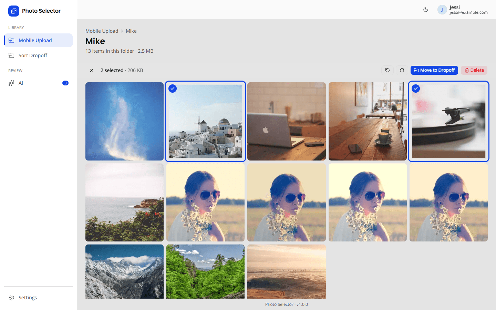
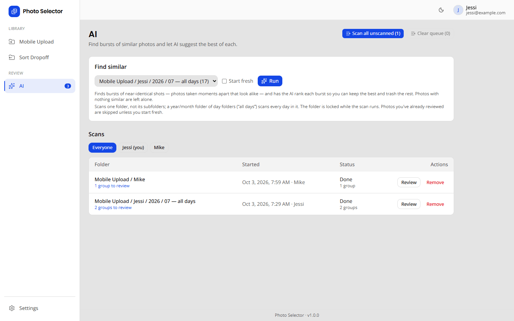
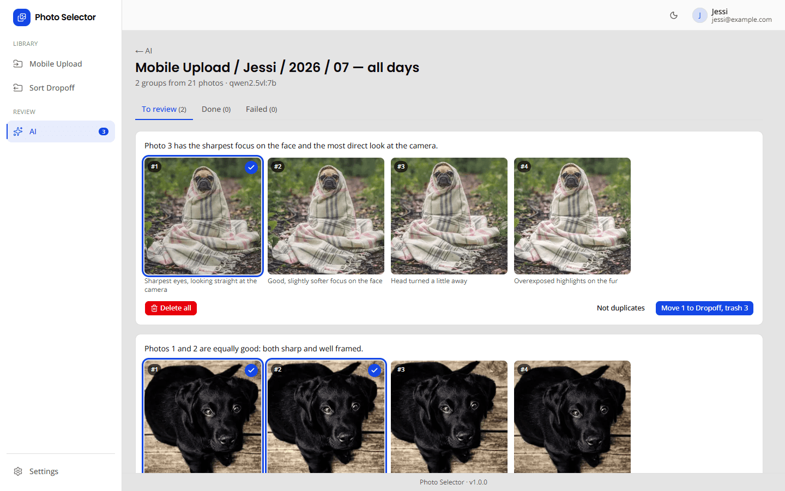
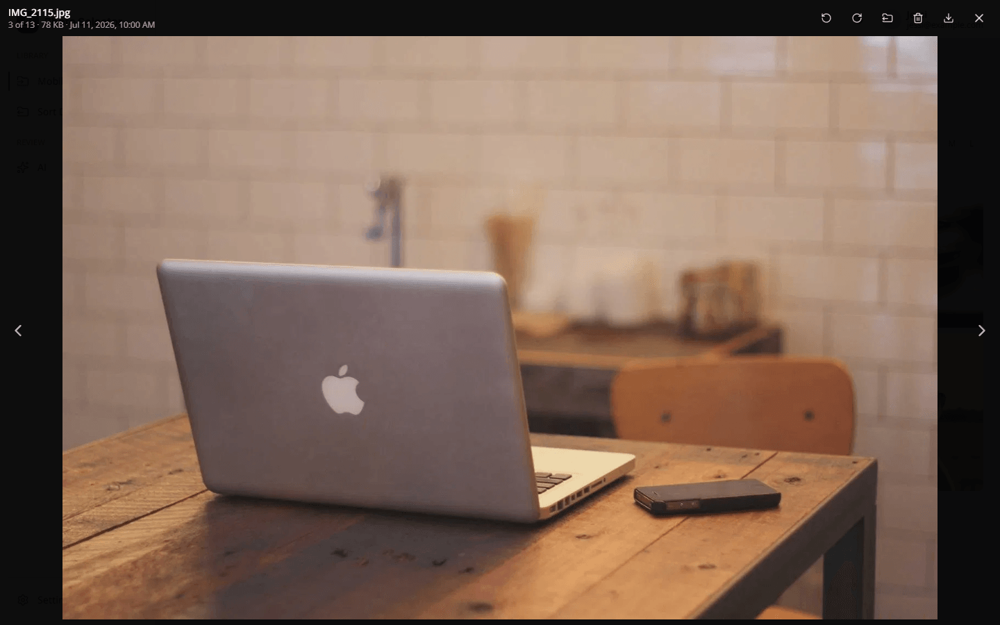
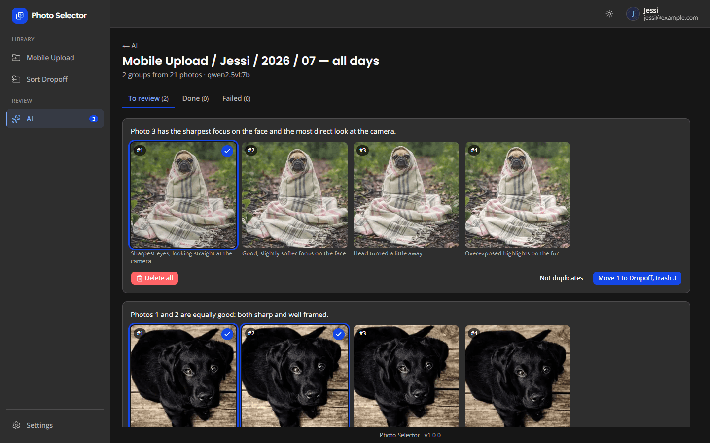

# Photo Selector

A web app for sorting phone uploads on a NAS. Browse `Mobile Upload`, keep the
photos worth keeping, delete the rest, and move the picks to `Sort Dropoff`.
It runs in a container on the NAS, next to the photos, so full-size images never
cross the network: you browse fast thumbnails from any device on the LAN.

An optional AI step finds bursts of near-identical shots and suggests the best
take of each, using any OpenAI-compatible vision model you host yourself.



## Features

**Library**
- Fast thumbnail grid for folders of any size (tested with 10,000 photos):
  only what's on screen is drawn, and thumbnails scrolled past are never made.
- Click to select, Shift-click for a range; move to Sort Dropoff, delete
  (to an in-app trash with Undo, purged after 30 days) or rotate (lossless for JPEG).
- Full-screen viewer with keyboard navigation, videos and iPhone HEIC photos.
- A background worker pre-makes thumbnails and watches for new uploads.

**AI review** (optional)
- Groups bursts locally, by capture time and visual similarity; nothing leaves
  the NAS except the groups sent to *your* AI server.
- The model ranks each burst: eyes open, looking at the camera, natural smile, sharp.
- Review page with the AI's picks pre-selected: **Move picks to Dropoff, trash
  the rest**, **Not duplicates**, **Delete all**, or **Accept all selections**
  for a whole page. Everything is undoable.
- Year/month/day upload folders (`2026/07/04`) are scanned a month at a time.
- **Scan all unscanned** queues every folder; the folder being scanned is locked
  so nothing changes under it.
- **Find Screenshots** tab: finds screenshots and saved images (memes,
  downloads, forwarded pictures) in a folder, to delete or move to Sort Dropoff
  in bulk. Photos with camera details and HEIC files skip the AI; the rest are
  sent four to a request. These scans don't lock the folder.
- **Quality Checks** tab: finds technically bad photos (motion blur, out of
  focus, closed eyes, far too dark or bright, pocket and other accidental shots,
  a finger over the lens) to delete in bulk. Every photo is sent, four to a
  request, and the AI says what's wrong with each one it flags.
- Editable AI instructions for each scan type (Settings → AI); the reply format stays fixed.

**Everything else**
- Accounts with admin and user roles, light and dark themes.
- Settings → Storage shows whether each folder is readable and writable, and
  the thumbnail worker's progress.

| AI scans | AI review |
| --- | --- |
|  |  |
| **Viewer** | **Dark theme** |
|  |  |

*Screenshots use stock photos from [Lorem Picsum](https://picsum.photos) (Unsplash licence); the AI results are sample data.*

## Install (Docker)

Images are published to GitHub Container Registry on every push to `main`
(`linux/amd64` and `linux/arm64`), tagged `latest` and `sha-<commit>`:
`ghcr.io/yatzin/photo-selector`.

### 1. Create a `docker-compose.yml`

On the NAS (or anywhere with Docker and access to the photo folders):

```yaml
services:
  photo-selector:
    image: ghcr.io/yatzin/photo-selector:latest
    container_name: photo-selector
    ports:
      - "3200:3200"
    volumes:
      # App data: database and thumbnail cache (~25 KB per photo). Not the photos.
      - /volume1/docker/photo-selector:/data
      # The two photo folders, and nothing else from the share. Left side = the
      # NAS's own path for the share folder (UGOS: folder properties, or `ls /volume1`).
      - "/volume1/Photo/Mobile Upload:/photos/upload"
      - "/volume1/Photo/Sort Dropoff:/photos/dropoff"
    environment:
      # The NAS user and group the app acts as. See "File share permissions" below.
      PUID: "1000"
      PGID: "10"

      # Signs login sessions. Generate your own: `openssl rand -base64 32`.
      # Changing it later signs everyone out.
      AUTH_SECRET: "replace-me"

      # Optional: the URL you browse to, e.g. http://192.168.1.50:3200.
      AUTH_URL: ""

      # First admin account, created only when the database is first set up.
      ADMIN_NAME: "Admin"
      ADMIN_EMAIL: "you@example.com"
      ADMIN_PASSWORD: "changeme-please"

      TZ: "America/New_York"

      # Optional: set to "off" to make thumbnails only when someone views them.
      # THUMB_WORKER: "off"
    restart: unless-stopped
    healthcheck:
      test: ["CMD", "wget", "-qO-", "http://127.0.0.1:3200/api/health"]
      interval: 30s
      timeout: 10s
      retries: 3
      start_period: 15s
```

The same file is in the repo: [`docker-compose.yml`](docker-compose.yml).

### 2. Start it

```sh
docker compose up -d
```

Open `http://<nas>:3200` and sign in with the admin account. Check
**Settings → Storage**: both folders should show a tick for *Read* and *Write*.

### 3. Update

```sh
docker compose pull && docker compose up -d
```

Each image is tagged `latest`, its version (e.g. `1.2.0`, the same version shown
at the bottom of every page) and `sha-<commit>`. To stay on a version, use
`ghcr.io/yatzin/photo-selector:1.2.0` instead of `latest`.

Database changes apply themselves on start.

### Folders

| NAS share path                  | In container       | Env override          |
| ------------------------------- | ------------------ | --------------------- |
| `\\ugreen\Photo\Mobile Upload`  | `/photos/upload`   | `PHOTOS_UPLOAD_DIR`   |
| `\\ugreen\Photo\Sort Dropoff`   | `/photos/dropoff`  | `PHOTOS_DROPOFF_DIR`  |
| (app data)                      | `/data`            | `DATABASE_URL`, `PHOTOS_CACHE_DIR` |

## File share permissions

The app runs as the user and group in `PUID` / `PGID`, so files it moves keep
normal ownership on the share. That user needs:

| Folder | Access | Why |
| --- | --- | --- |
| Mobile Upload (`/photos/upload`) | **read + write**, including subfolders | Lists photos, moves picks out, moves deleted photos into its trash folder, writes rotations |
| Sort Dropoff (`/photos/dropoff`) | **read + write** | Receives the photos you keep; deleting and rotating work there too |
| App data (`/data`) | read + write | Database and thumbnail cache. The container makes it owned by `PUID:PGID` on start |

Deleted photos go to a hidden `.photo-selector-trash` folder inside each photo
folder, so Undo can put them back. It's emptied after 30 days. Both photo
folders should be on the same volume so moves are instant. Across volumes, the
app copies, verifies and then deletes, which is slower but safe.

**Choosing PUID and PGID**

1. Pick a NAS account that can open both folders over the network
   (e.g. the account you use for `\\ugreen\Photo`).
2. Over SSH, run `id <that-user>`:
   ```
   uid=1000(nasuser) gid=10(admin) groups=10(admin),100(users),1000(standard)
   ```
   `PUID` is the `uid`.
3. For `PGID`, pick the group the share is actually open to. The app gets only
   this one group, not all of the user's groups. On UGOS, shared folders are
   usually controlled by an access list that admits `admin` (10), not `users`
   (100), even though plain `ls -l` shows the folder as open to everyone.

**Checking access**

Settings → Storage and `http://<nas>:3200/api/health` report whether each
folder can be read and written. If the library says *"Mobile Upload isn't
available"*, the user/group can't open the folder. To test candidate groups
from the NAS:

```sh
sudo docker exec photo-selector sh -c 'for g in 10 100 1000; do printf "gid %s: " $g; gosu 1000:$g ls /photos/upload >/dev/null 2>&1 && echo OK || echo denied; done'
```

Use a group that says `OK`, update `PGID`, and run `docker compose up -d`.

## AI setup

Settings → AI (admins). Any OpenAI-compatible server with a vision model works,
for example:

- **Ollama** on a PC with a GPU: `ollama pull qwen2.5vl:7b`, base URL
  `http://<pc>:11434/v1`. Start Ollama with `OLLAMA_HOST=0.0.0.0` so the NAS can reach it.
- **llama.cpp / LM Studio** serving a vision model, or a hosted API with a key.

**Test connection** sends a small red image and checks the model can see it.
Each group is sent as one request with every photo in it (resized to
"Image size sent", 768 px by default). Bursts larger than "Largest group" are
split. Find Screenshots and Quality Checks send four images per request. If the server sits behind a proxy, make sure its read timeout is longer
than a group takes. Eight photos can take 80–90 seconds on a mid-size local model.

## Local development

```sh
cp .env.example .env      # set AUTH_SECRET; photo folders default to ./dev-photos
npm install
npm run dev               # http://localhost:3200 (applies migrations and seeds the admin first)
npm test                  # unit and integration tests
```

`PHOTOS_UPLOAD_DIR` can point straight at `\\ugreen\Photo\Mobile Upload` to try
the app against real photos.

Built with Next.js 16, React 19, Auth.js, Prisma + SQLite, sharp, Tailwind and
shadcn/ui. The account, theme and settings shell is adapted from HomeCenter.

## License

[MIT](LICENSE)
